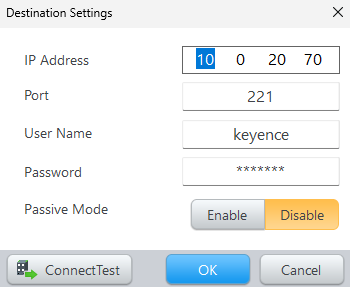
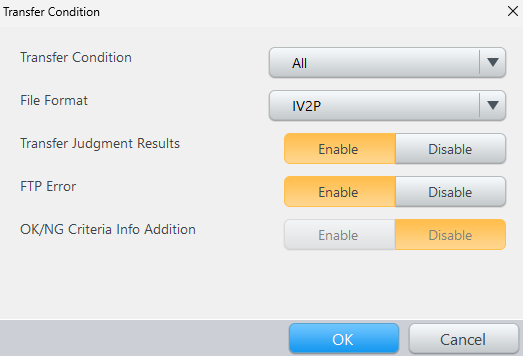
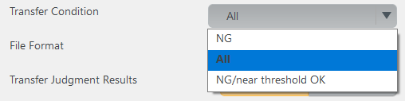
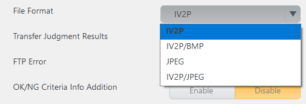
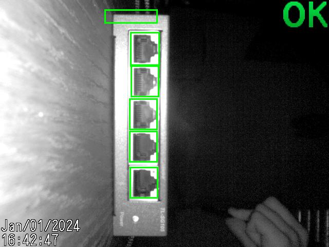
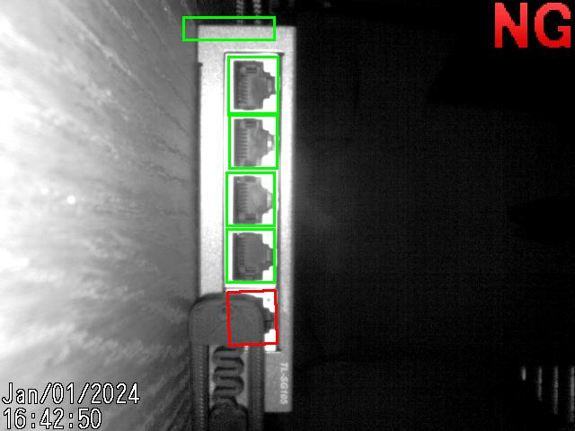

### Store Image Settings

#### FTP Connection Settings

Fill out FTP Connection Parameter and Test the connection



#### Transfer Condition



Transfer Condition Available



File Format



#### Transfer Judgement Results

If enabled the camera creates a text file named like `00000_004_OK_Jan012024_164059.txt` with the results of the detection.
Example:

```
Time and Date	Jan/01/2024	16:40:59
Program No.	4
Trigger No.	11
TIME[ms]	93
Total Status	OK
Position Adjustment	OK	100
Tool01:Port_1(Outline)	OK	93
Tool02:Port_2(Outline)	OK	98
Tool03:Port_3(Outline)	OK	95
Tool04:Port_4(Outline)	OK	95
Tool05:Port_5(Outline)	OK	95
```

#### OK/NG Criteria Info Addition

This will show the criteria on the image.



